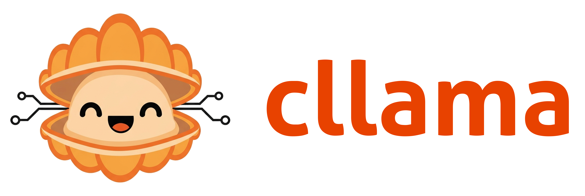
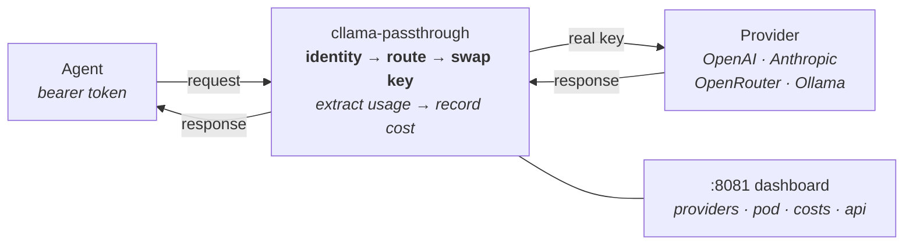
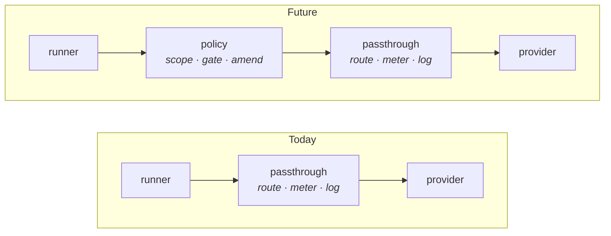

# 

**The blood-brain barrier for autonomous agents.**

`cllama-passthrough` is the reference implementation of the [cllama proxy standard](https://github.com/mostlydev/clawdapus/blob/master/docs/CLLAMA_SPEC.md) — a context-aware, bidirectional LLM governance proxy that enforces **credential starvation** on untrusted agent workloads.

It is a single Go binary with zero dependencies. 15 MB distroless image. Two ports: `:8080` for the OpenAI-compatible API, `:8081` for the operator dashboard. Every agent request is identity-verified, provider-routed, cost-tracked, and audit-logged — transparently. The agent never knows the proxy exists.



---

## The Architecture

A `cllama` proxy sits between the runner (the agent's application code) and the LLM provider. In the [Clawdapus](https://github.com/mostlydev/clawdapus) architecture, agents are treated as untrusted workloads — containers that can think, but whose compute access is a privilege granted by the operator, not a right assumed by the process.

**Credential starvation** is the enforcement mechanism. The agent container is provisioned with a unique bearer token (`<agent-id>:<48-hex-secret>`). The proxy holds the real provider API keys. Because the agent lacks the credentials to call providers directly, all inference *must* transit the proxy — even if a compromised agent tries to bypass its configured base URL.

The "passthrough" reference performs no cognitive mutation. It verifies identity, routes to the correct upstream, swaps credentials, streams the response, extracts token usage, and records cost. Future proxy types (`cllama-policy`) will add bidirectional interception — evaluating outbound prompts against the agent's behavioral contract, and amending or dropping inbound responses that drift from purpose.

### Request lifecycle

```
1.  Agent sends POST /v1/chat/completions
    Authorization: Bearer tiverton:a1b2c3d4e5f6...
    {"model": "anthropic/claude-sonnet-4", "messages": [...]}

2.  Identity resolution
    Parse bearer token → load /claw/context/tiverton/metadata.json
    Validate secret (constant-time comparison)

3.  Provider routing
    Split model on "/" → provider=anthropic, model=claude-sonnet-4
    Look up provider config → base_url, auth scheme, real API key

4.  Credential swap
    Strip agent's bearer token
    Inject real key (Bearer, X-Api-Key, or none — per provider)

5.  Forward + stream
    Proxy request to upstream, stream response back transparently

6.  Cost extraction
    Parse usage from response body (JSON or SSE stream)
    Multiply by pricing table → record per (agent, provider, model)

7.  Audit log
    Emit structured JSON to stdout: timestamp, agent, model,
    latency, status, tokens_in, tokens_out, cost_usd, intervention
```

---

## Building

```bash
# Binary
go build -o cllama-passthrough ./cmd/cllama-passthrough

# Docker (~15 MB distroless)
docker build -t ghcr.io/mostlydev/cllama-passthrough:latest .
```

Zero external dependencies. Go standard library only.

---

## Running

```bash
./cllama-passthrough
```

Or with Docker:

```bash
docker run -p 8080:8080 -p 8081:8081 \
  -e ANTHROPIC_API_KEY=sk-ant-... \
  -e OPENROUTER_API_KEY=sk-or-... \
  -v ./context:/claw/context:ro \
  ghcr.io/mostlydev/cllama-passthrough:latest
```

---

## Configuration

### Environment

| Variable | Default | Purpose |
|---|---|---|
| `LISTEN_ADDR` | `:8080` | API server |
| `UI_ADDR` | `:8081` | Operator dashboard |
| `CLAW_CONTEXT_ROOT` | `/claw/context` | Per-agent context mount |
| `CLAW_AUTH_DIR` | `/claw/auth` | Provider credentials |
| `CLAW_POD` | | Pod name (dashboard display) |
| `OPENAI_API_KEY` | | Provider key override |
| `ANTHROPIC_API_KEY` | | Provider key override |
| `OPENROUTER_API_KEY` | | Provider key override |

Environment variables override keys saved via the web UI.

### Agent context

Each agent is a subdirectory under `CLAW_CONTEXT_ROOT`:

```
/claw/context/
├── tiverton/
│   ├── metadata.json     # bearer token, pod, service, type
│   ├── AGENTS.md         # behavioral contract
│   └── CLAWDAPUS.md      # infrastructure map
├── westin/
│   └── ...
└── allen/
    └── ...
```

`metadata.json`:
```json
{
  "token": "tiverton:a1b2c3d4e5f6a1b2c3d4e5f6a1b2c3d4e5f6a1b2c3d4e5f6",
  "pod": "trading-desk",
  "service": "tiverton",
  "type": "openclaw"
}
```

When orchestrated by Clawdapus, `claw compose up` generates all of this — tokens via `crypto/rand`, context from the pod manifest, provider keys injected only into the proxy env.

### Provider registry

`providers.json` in `CLAW_AUTH_DIR`:

```json
{
  "providers": {
    "anthropic": {
      "base_url": "https://api.anthropic.com/v1",
      "api_key": "sk-ant-...",
      "auth": "x-api-key"
    },
    "openrouter": {
      "base_url": "https://openrouter.ai/api/v1",
      "api_key": "sk-or-...",
      "auth": "bearer"
    },
    "ollama": {
      "base_url": "http://ollama:11434/v1",
      "auth": "none"
    }
  }
}
```

Auth schemes: `bearer` (OpenAI, OpenRouter), `x-api-key` (Anthropic), `none` (Ollama, local models).

---

## Operator Dashboard

Built-in web UI on `:8081`. No JavaScript frameworks, no build step — Go templates compiled into the binary.

| Page | Path | Function |
|---|---|---|
| Providers | `/` | Manage upstream provider configs. Routing diagram. Add/update/delete. |
| Pod | `/pod` | Agent cards — type, request count, cost, models used. |
| Costs | `/costs` | Real-time spend. Total banner, per-agent breakdown, nested model detail. |
| Costs API | `/costs/api` | JSON. Pipe to Grafana, alerting, `jq`, or the Master Claw. |

Cost state is in-memory — resets on restart. Structured logs on stdout are the durable audit record.

---

## API Surface

**`:8080` — Proxy API**

| Method | Path | Description |
|---|---|---|
| `POST` | `/v1/chat/completions` | OpenAI-compatible chat completions |
| `POST` | `/v1/messages` | Anthropic Messages API (native format) |
| `GET` | `/health` | `{"ok": true}` |

Both endpoints support streaming. The Anthropic endpoint forwards `Anthropic-Version` and `Anthropic-Beta` headers and uses `X-Api-Key` authentication automatically.

---

## Audit Logging

Every request/response pair emits a structured JSON log line to stdout:

```json
{
  "ts": "2026-02-27T15:23:45Z",
  "claw_id": "tiverton",
  "type": "response",
  "model": "anthropic/claude-sonnet-4",
  "latency_ms": 1250,
  "status_code": 200,
  "tokens_in": 100,
  "tokens_out": 50,
  "cost_usd": 0.0105,
  "intervention": null
}
```

`intervention` is always `null` in passthrough mode. Policy proxies will populate it with the rule that triggered an amendment, drop, or reroute — the raw material for drift scoring.

These logs feed `docker compose logs`, fleet telemetry pipelines, and `claw audit`.

---

## The cllama Standard

`cllama` is an open standard for context-aware LLM governance proxies. Any OpenAI-compatible proxy image that can consume Clawdapus context can act as a governance layer. The [full specification](https://github.com/mostlydev/clawdapus/blob/master/docs/CLLAMA_SPEC.md) defines:

- **Bidirectional interception** — outbound prompt evaluation, inbound response amendment
- **Multi-agent identity** — single proxy serves an entire pod, resolving callers by bearer token
- **Compute metering** — per-agent budgets, model downgrading, rate limiting
- **Structured telemetry** — intervention logs for independent drift scoring

The passthrough reference implements the transport layer: identity, routing, cost tracking, audit logging. It establishes the plumbing that policy proxies build on.



---

## Part of Clawdapus

This proxy is one component in [Clawdapus](https://github.com/mostlydev/clawdapus) — infrastructure-layer governance for AI agent containers. Docker on Rails for Claws.

```
Clawfile            extended Dockerfile → OCI image
claw-pod.yml        extended docker-compose → governed fleet
claw compose up     transpile, enforce, wire cllama, deploy
cllama-passthrough  credential starvation + cost accounting + audit trail
```

Standalone operation is fully supported. Set up the context directory, write a `providers.json`, point your agents at `:8080`, and the proxy does the rest.

---

## Roadmap

| Feature | Description |
|---|---|
| **Budget enforcement** | Hard spend caps per agent. `429` when exceeded. The agent's budget is a configuration concern, not a prompt concern. |
| **Model allowlisting** | Per-agent model ACLs from `metadata.json`. |
| **Persistent cost state** | Survive restarts. Rebuild from audit logs or external store. |
| **`cllama-policy`** | Bidirectional interception. Reads the behavioral contract. Makes allow/deny/amend decisions on live LLM traffic. The passthrough is the plumbing; the policy proxy is the brain. |
